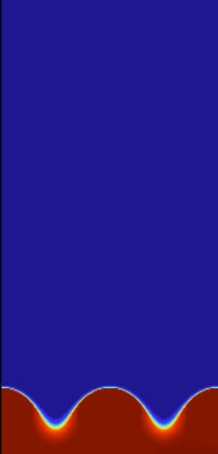
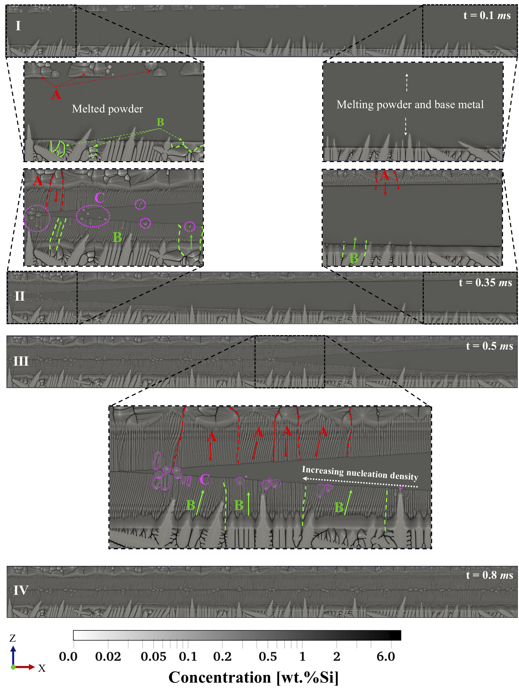

<h1>Projects</h1>

<h2>Pattern formation in Reaction-Diffusion systems Forest fire model - PhD McGill September 2017</h2>

<li>Developed finite difference C++ codes for large-scale parallel computing, achieved 10x speedup</li>
<li>Specialized and optimized the pre-existing AMR code for simulations of heat/mass transfer in 2D &
     3D, (2 orders of magnitude speedup & reduced the computational cost and memory usage)
</li>

 
  

<h2>Simulation of heat & mass transfer in particulate fuel combustion systems - Research Associate McGill Sep 2017- January 2018</h2>

 <li>Developed C++ codes for large-sacle parallel computing using Adaptive Mesh Refinement (AMR) algorithm, 10x speed up    
      across 512 computational cores</li>
<li>Coded shell scripts & Python scripts to collect, interpret, and visualize more than 10TB of data</li>
<li>Programmed Matlab codes to perform spectral analysis, improved the accuracy of estimates by 20%</li>

<!-- -->
 

<h2>Solidification process of sinterd powder Aluminum-based alloys - Marine Additive Manufacturing Centre of Excellence, University of New Brunswick Febreuary 2018 - August 2019 </h2>
     
<li>Designed & implemented a high performance computing algorithm for large-scale simulations of a solidification during 3D Metal Printing process of mechanical parts, resulting in 35x speedup across 1024 cores by applying MPI techniques.</li> 
     
<li>Initiated process automation that required to collect, interpret, and visualize more than 10TB of data during 3D printing simulation. Accelerated processing time 7-fold (from 14 to 2 days).</li> 
     
<li>Predict spatio-temporal patterns in different physical systems based on the processing parameters using Neural Network analysis assisting in design of new Functionally Graded Materials for specific functions & applications. Executed 40+ simulations using 2000+cores; collected and analyzed ~ 10TB of data.</li>

<!-- -->

  
  <!---->

<h2>Capstone project (The Data Incubator Fellowship)</h2>
